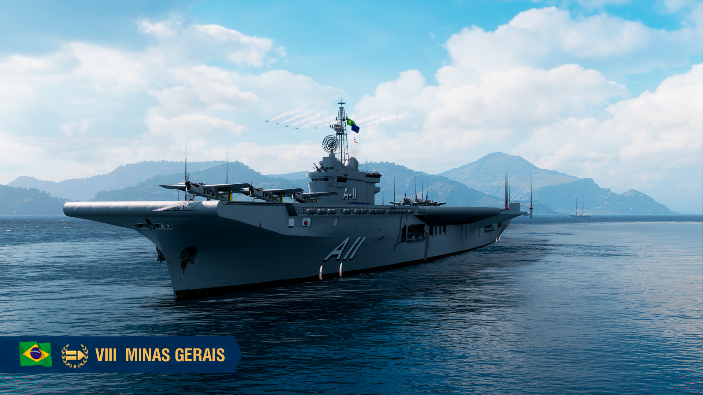

# WoWSMinasGerais
 Modification for World of Warships that turns Colossus into Minas Gerais.

"Qual Cisne Branco que em noite de lua, vai deslizando num lago azul"
- A fitting description, from the Brazilian Navy's anthem.

## Installation
1 - Click the "Code" button, download the ZIP file.
2 - Once you have the file downloaded, extract it. When extracted, a folder called "PnFMods", a folder called "content" and a Python file called "PnFModsLoader.py" will appear.
3.1. - If this is your first time installing a mod, you will need to go where your World of Warships client is installed. The usual path is:
 "This PC/ Local Disk (C:)/games/World_of_Warships_NA/bin/". Inside /bin you will find a folder with numbers, the most recent update has the highest number. (you can sort by latest modification and pick the most recent). Once you've reached the patch's folder, you should see a "res_mods" folder. 
 - 3.1.1. - Now, you have to paste the "PnFMods" folder, the "content" folder and the Python file you extracted earlier inside the "res_mods" folder, **this installs the mod**. (The path on your Windows Explorer will probably look like this: "This PC/ Local Disk (C:)/games/World_of_Warships_NA/bin/XXXXXX/res_mods", the numbers being the current patch's folder.) 
 - 3.1.2. - If you happened to do this with your game open and don't see the mod, you will need to either make the game 'reload' the files or just do a restart of the client. If after restarting, the modification still doesn't work, check if you put the 'res_mods' folder in the right place. (sometimes, for those with pre-install updates enabled on launcher, you will need to install it on the 2nd most recent folder back in the /bin folder). If the mod still doesn't work, feel free to contact me here. 
3.2. - If the system asks you to replace any files, do so.

## Uninstall:

1 - Uninstalling when this is your only mod installed:

Go to the "res_mods" folder. (Detailed instructions on how to find it can be found above). Inside it, the only folders will be "PnFMods" and "content", and to uninstall this mod all you need to do is delete these folders.
**This only applies if you only have this modification installed.**

2 - Uninstalling when you have other mods installed:

Go to the "res_mods" folder. (Detailed instructions on how to find it can be found above). Inside it, find the "PnFMods" folder. Open it, and you should see a folder called "MinasGerais", which you will delete. 
Now, enter the "content" folder and keep going inside the subfolders until you get to "res_mods\content\gameplay\uk\aircraft\bomber\textures". 
Here, you will delete the files "BAB702_Fairey_Barracuda_MkV_Colossus_mg.dds" and "BAB702_Fairey_Barracuda_MkV_Colossus_a.dds". 
Now, head to "res_mods\content\gameplay\common\camouflage\textures". Here, you will delete only "BSA013_Colossus_1945_Deckhouse_camo_01.dds" and "BSA013_Colossus_1945_Hull_camo_01.dds"

**This should conclude the uninstallation process.**

If after doing this, the mod keeps being displayed, make the game reload the files by selecting another ship and going back to the modded ship or doing a complete restart of the client. If this doesn't work, check if you deleted the right files. ***If you happen to have any issues after all this, feel free to contact me on Discord.***

**Important**: A few texture files sometimes end up bigger than expected, this can result in longer load times in Port.

**Warning:** if you happen to be using all the black skins and this one, and you happen to get all 4 ships in one battle, all being rendered at once, your PC *might* drop FPS considerably.

**This mod will be shown "on top" of any camouflage you apply, with a few exceptions and details**: As-is, the BASE version will use Colossus' color schemes for doing the cammo. But, the paint is the same across the entire hull. Camouflages that are "remodels" of the ship do not get replaced by this mod (for now, Colossus doesn't have any). The EXTRAS adds the modification of color scheme, also transforms the display name of Colossus into Minas Gerais, with the appropriate descriptions (please read it!!).

### I hope everyone enjoys this mod as much as I enjoyed making it! (and oh boy, this one took a long while to cook)

